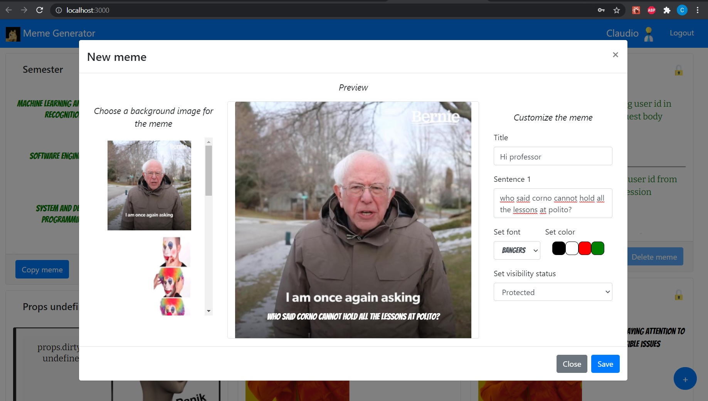

# Exam #2: "Meme Generator"
## Student: s292523 TANCREDI CLAUDIO

## React Client Application Routes

- Route `/`: home page with the list of memes and the components needed to operate on them
- Route `/login`: login page
- Default route: will match anything else that is different from the previous ones and will show a 404 GIF

## API Server

### Perform login

**HTTP Method**: `POST` <br/>
**URL**: `/api/sessions` <br/>
**Description**: Perform login for a user with username (e-mail) and password <br/>
**Sample request**: <br/>
```http
POST http://localhost:3001/api/sessions
Content-Type: application/json

{
  "username": "claudiotancredi@polito.it", 
  "password": "eusebio"
}
```
```http
POST http://localhost:3001/api/sessions
Content-Type: application/json

{
  "username": "claudiotancredi@polito.it", 
  "password": "akkjfingf"
}
```
**Sample response**: <br/>
```http
HTTP/1.1 200 OK
X-Powered-By: Express
Content-Type: application/json; charset=utf-8
Content-Length: 64
ETag: W/"40-RfLBBjlikySea9MswU6E+/y3RXM"
Set-Cookie: connect.sid=s%3Ahq9PiGc7k7ZfiZcvIBxxk40qs_XxhqPg.OjtI6RRtgBU70ntf3h%2BsfNEp%2F%2FYh3Hx6oghX7m8%2Fd3k; Path=/; HttpOnly; SameSite=Strict
Date: Sun, 11 Jul 2021 05:22:44 GMT
Connection: close

{
  "id": 1,
  "username": "claudiotancredi@polito.it",
  "name": "Claudio"
}
```
**Error response(s)**: <br/>
```http
HTTP/1.1 401 Unauthorized
X-Powered-By: Express
Content-Type: application/json; charset=utf-8
Content-Length: 49
ETag: W/"31-Zoymuc0GB5Y05HVb13yrtWLixv4"
Date: Sun, 11 Jul 2021 05:24:41 GMT
Connection: close

{
  "message": "Incorrect username and/or password."
}
```

### Check if the user is logged in or not

**HTTP Method**: `GET` <br/>
**URL**: `/api/sessions/current` <br/>
**Description**: Check if the user is logged in or not <br/>
**Sample request**: <br/>
```http
GET http://localhost:3001/api/sessions/current 
```
**Sample response**: <br/>
```http
HTTP/1.1 200 OK
X-Powered-By: Express
Content-Type: application/json; charset=utf-8
Content-Length: 64
ETag: W/"40-RfLBBjlikySea9MswU6E+/y3RXM"
Date: Sun, 11 Jul 2021 05:25:59 GMT
Connection: close

{
  "id": 1,
  "username": "claudiotancredi@polito.it",
  "name": "Claudio"
}
```
**Error response(s)**: <br/>
```http
HTTP/1.1 401 Unauthorized
X-Powered-By: Express
Content-Type: application/json; charset=utf-8
Content-Length: 33
ETag: W/"21-V8x1OYsvKEIKIAIW760m3YHzhZ0"
Date: Sun, 11 Jul 2021 05:26:23 GMT
Connection: close

{
  "error": "Unauthenticated user!"
}
```

### Perform logout

**HTTP Method**: `DELETE` <br/>
**URL**: `/api/sessions/current` <br/>
**Description**: Perform logout <br/>
**Sample request**: <br/>
```http
DELETE http://localhost:3001/api/sessions/current 
```
**Sample response**: <br/>
```http
HTTP/1.1 200 OK
X-Powered-By: Express
Date: Sun, 11 Jul 2021 05:27:03 GMT
Connection: close
Transfer-Encoding: chunked
```

### Retrieve all the memes (both public and protected)

**HTTP Method**: `GET` <br/>
**URL**: `/api/memes` <br/>
**Description**: Retrieve the list of all the memes (both public and protected) <br/>
**Sample request**: <br/>
```http
GET http://localhost:3001/api/memes
```
**Sample response**: <br/>
```http
HTTP/1.1 200 OK
X-Powered-By: Express
Content-Type: application/json; charset=utf-8
Content-Length: 2555
ETag: W/"9fb-m8Jm8HFQBgSSQ5urtnyoNZhkdbM"
Date: Sun, 11 Jul 2021 05:29:06 GMT
Connection: close

[
  {
    "id": 1,
    "title": "Creativity",
    "url": "/static/old.png",
    "sentence1": "give me creativity because I'm not funny enough to compose these memes",
    "sentence2": "",
    "sentence3": "",
    "cssSentencesPosition": "bottom-single-text2,,",
    "cssFontClass": "font-bangers",
    "cssColourClass": "color-white",
    "protected": 1,
    "name": "Claudio",
    "user": 1
  },
  {
    "id": 2,
    "title": "Semester",
    "url": "/static/winnie.png",
    "sentence1": "PDS",
    "sentence2": "WA",
    "sentence3": "",
    "cssSentencesPosition": "top-right,bottom-right,",
    "cssFontClass": "font-bitter",
    "cssColourClass": "color-green",
    "protected": 0,
    "name": "Claudio",
    "user": 1
  },
  {
    "id": 3,
    "title": "Semester part 2",
    "url": "/static/clown.png",
    "sentence1": "Machine learning",
    "sentence2": "Software engineering",
    "sentence3": "PDS",
    "cssSentencesPosition": "top-left,center-left,bottom-left",
    "cssFontClass": "font-bitter",
    "cssColourClass": "color-red",
    "protected": 1,
    "name": "Francesco",
    "user": 2
  },
  {
    "id": 4,
    "title": "Exam 13/07",
    "url": "/static/panik.png",
    "sentence1": "",
    "sentence2": "",
    "sentence3": "18",
    "cssSentencesPosition": "top-left,center-left,bottom-left",
    "cssFontClass": "font-bangers",
    "cssColourClass": "color-black",
    "protected": 0,
    "name": "Francesco",
    "user": 2
  },
  {
    "id": 5,
    "title": "New students",
    "url": "/static/toystory.png",
    "sentence1": "See how new students still smile",
    "sentence2": "",
    "sentence3": "",
    "cssSentencesPosition": "bottom-single-text,,",
    "cssFontClass": "font-bitter",
    "cssColourClass": "color-white",
    "protected": 0,
    "name": "Alessandro",
    "user": 3
  },
  {
    "id": 6,
    "title": "Git tools",
    "url": "/static/drake.png",
    "sentence1": "GitLab",
    "sentence2": "GitHub",
    "sentence3": "",
    "cssSentencesPosition": "top-right,bottom-right,",
    "cssFontClass": "font-bangers",
    "cssColourClass": "color-red",
    "protected": 1,
    "name": "Alessandro",
    "user": 3
  },
  {
    "id": 7,
    "title": "Semester part 2 - copy",
    "url": "/static/clown.png",
    "sentence1": "Machine learning",
    "sentence2": "Software engineering",
    "sentence3": "PDS",
    "cssSentencesPosition": "top-left,center-left,bottom-left",
    "cssFontClass": "font-bitter",
    "cssColourClass": "color-red",
    "protected": 1,
    "name": "Alessandro",
    "user": 3
  },
  {
    "id": 8,
    "title": "New students - copy",
    "url": "/static/toystory.png",
    "sentence1": "See how new students still smile",
    "sentence2": "",
    "sentence3": "",
    "cssSentencesPosition": "bottom-single-text,,",
    "cssFontClass": "font-bitter",
    "cssColourClass": "color-white",
    "protected": 0,
    "name": "Francesco",
    "user": 2
  },
  {
    "id": 9,
    "title": "Exam 13/07 - copy",
    "url": "/static/panik.png",
    "sentence1": "18",
    "sentence2": "",
    "sentence3": "18",
    "cssSentencesPosition": "top-left,center-left,bottom-left",
    "cssFontClass": "font-bangers",
    "cssColourClass": "color-black",
    "protected": 0,
    "name": "Claudio",
    "user": 1
  }
]
```
**Error response(s)**: <br/>
```http
HTTP/1.1 401 Unauthorized
X-Powered-By: Express
Content-Type: application/json; charset=utf-8
Content-Length: 29
ETag: W/"1d-UanYH2PSt0KmMjFYYCxoQ9Lf+Ao"
Date: Sun, 11 Jul 2021 05:30:46 GMT
Connection: close

{
  "error": "not authenticated"
}
```

### Retrieve all the public memes

**HTTP Method**: `GET` <br/>
**URL**: `/api/memes/filter=public` <br/>
**Description**: Retrieve the list of all the public memes<br/>
**Sample request**: <br/>
```http
GET http://localhost:3001/api/memes/filter=public
```
**Sample response**: <br/>
```http
HTTP/1.1 200 OK
X-Powered-By: Express
Content-Type: application/json; charset=utf-8
Content-Length: 1365
ETag: W/"555-lf/WugXWr58ctz2NS0mOgyYLEj8"
Date: Sun, 11 Jul 2021 05:32:48 GMT
Connection: close

[
  {
    "id": 2,
    "title": "Semester",
    "url": "/static/winnie.png",
    "sentence1": "PDS",
    "sentence2": "WA",
    "sentence3": "",
    "cssSentencesPosition": "top-right,bottom-right,",
    "cssFontClass": "font-bitter",
    "cssColourClass": "color-green",
    "protected": 0,
    "name": "Claudio",
    "user": 1
  },
  {
    "id": 4,
    "title": "Exam 13/07",
    "url": "/static/panik.png",
    "sentence1": "",
    "sentence2": "",
    "sentence3": "18",
    "cssSentencesPosition": "top-left,center-left,bottom-left",
    "cssFontClass": "font-bangers",
    "cssColourClass": "color-black",
    "protected": 0,
    "name": "Francesco",
    "user": 2
  },
  {
    "id": 5,
    "title": "New students",
    "url": "/static/toystory.png",
    "sentence1": "See how new students still smile",
    "sentence2": "",
    "sentence3": "",
    "cssSentencesPosition": "bottom-single-text,,",
    "cssFontClass": "font-bitter",
    "cssColourClass": "color-white",
    "protected": 0,
    "name": "Alessandro",
    "user": 3
  },
  {
    "id": 8,
    "title": "New students - copy",
    "url": "/static/toystory.png",
    "sentence1": "See how new students still smile",
    "sentence2": "",
    "sentence3": "",
    "cssSentencesPosition": "bottom-single-text,,",
    "cssFontClass": "font-bitter",
    "cssColourClass": "color-white",
    "protected": 0,
    "name": "Francesco",
    "user": 2
  },
  {
    "id": 9,
    "title": "Exam 13/07 - copy",
    "url": "/static/panik.png",
    "sentence1": "18",
    "sentence2": "",
    "sentence3": "18",
    "cssSentencesPosition": "top-left,center-left,bottom-left",
    "cssFontClass": "font-bangers",
    "cssColourClass": "color-black",
    "protected": 0,
    "name": "Claudio",
    "user": 1
  }
]
```

### Create a new meme

**HTTP Method**: `POST` <br/>
**URL**: `/api/memes` <br/>
**Description**: Create a new resource with the new meme <br/>
**Sample requests**: <br/>
```http
POST http://localhost:3001/api/memes
Content-Type: application/json

{
    "title": "Test1",
    "imageId": 1,
    "sentence1": "Text1",
    "sentence2": "",
    "sentence3": "",
    "cssFontClass":"font-bangers",
    "cssColourClass":"color-white",
    "prot": true
}
```
```http
POST http://localhost:3001/api/memes
Content-Type: application/json

{
    "title": "ca",
    "imageId": "String",
    "sentence1": "",
    "sentence2": 4,
    "sentence3": "",
    "cssFontClass":5,
    "cssColourClass":true,
    "prot": "String"
}
```
**Sample response**: <br/>
```http
HTTP/1.1 201 Created
X-Powered-By: Express
Location: http://localhost:3001/api/memes/10
Content-Type: application/json; charset=utf-8
Content-Length: 103
ETag: W/"67-51BwmR0vYDZSql4daCYrB4kUQ0w"
Date: Sun, 11 Jul 2021 05:37:46 GMT
Connection: close

{
  "id of the new meme": 10,
  "outcome": "success, see Location header for the location of the new resource"
}
```
**Error response(s)**: <br/>
```http
HTTP/1.1 401 Unauthorized
X-Powered-By: Express
Content-Type: application/json; charset=utf-8
Content-Length: 29
ETag: W/"1d-UanYH2PSt0KmMjFYYCxoQ9Lf+Ao"
Date: Sun, 11 Jul 2021 05:36:48 GMT
Connection: close

{
  "error": "not authenticated"
}
```
```http
HTTP/1.1 422 Unprocessable Entity
X-Powered-By: Express
Content-Type: application/json; charset=utf-8
Content-Length: 816
ETag: W/"330-VSs0CRY8ewTGQWspTUPdjHK4Apg"
Date: Sun, 11 Jul 2021 18:13:53 GMT
Connection: close

{
  "errors": [
    {
      "value": "String",
      "msg": "Must be an integer",
      "param": "imageId",
      "location": "body"
    },
    {
      "value": "String",
      "msg": "Must be a boolean (true/false)",
      "param": "prot",
      "location": "body"
    },
    {
      "value": "",
      "msg": "Sentences must be strings and at least one of them must be non-empty",
      "param": "sentence1",
      "location": "body"
    },
    {
      "value": 4,
      "msg": "Sentences must be strings and at least one of them must be non-empty",
      "param": "sentence2",
      "location": "body"
    },
    {
      "value": "",
      "msg": "Sentences must be strings and at least one of them must be non-empty",
      "param": "sentence3",
      "location": "body"
    },
    {
      "value": 5,
      "msg": "Must be a string",
      "param": "cssFontClass",
      "location": "body"
    },
    {
      "value": true,
      "msg": "Must be a string",
      "param": "cssColourClass",
      "location": "body"
    },
    {
      "value": "ca",
      "msg": "Must be at least 5 chars long",
      "param": "title",
      "location": "body"
    }
  ]
}
```
### Delete a meme of the logged user given its id

**HTTP Method**: `DELETE` <br/>
**URL**: `/api/memes/:id` <br/>
**Description**: Delete a meme of the logged user given its id <br/>
**Sample requests**: <br/>
```http
DELETE http://localhost:3001/api/memes/10
```
```http
DELETE http://localhost:3001/api/memes/2a
```
```http
DELETE http://localhost:3001/api/memes/2233
```
**Sample response**: <br/>
```http
HTTP/1.1 200 OK
X-Powered-By: Express
Content-Type: application/json; charset=utf-8
Content-Length: 51
ETag: W/"33-62VNW2nzI85+iVgQCsYLcSaF4GY"
Date: Sun, 11 Jul 2021 05:44:11 GMT
Connection: close

{
  "id of the deleted meme": "10",
  "outcome": "success"
}
```
**Error response(s)**: <br/>
```http
HTTP/1.1 401 Unauthorized
X-Powered-By: Express
Content-Type: application/json; charset=utf-8
Content-Length: 29
ETag: W/"1d-UanYH2PSt0KmMjFYYCxoQ9Lf+Ao"
Date: Mon, 12 Jul 2021 06:53:24 GMT
Connection: close

{
  "error": "not authenticated"
}
```
```http
HTTP/1.1 404 Not Found
X-Powered-By: Express
Content-Type: application/json; charset=utf-8
Content-Length: 93
ETag: W/"5d-riCBP30vIk0DXa8F5LK1b2UOg/4"
Date: Sun, 11 Jul 2021 05:42:03 GMT
Connection: close

{
  "errors": [
    {
      "value": "2a",
      "msg": "Must be an integer value",
      "param": "id",
      "location": "params"
    }
  ]
}
```
```http
HTTP/1.1 404 Not Found
X-Powered-By: Express
Content-Type: application/json; charset=utf-8
Content-Length: 181
ETag: W/"b5-hUPr1j4gFDhSnjmtlw5asYcNDeU"
Date: Sun, 11 Jul 2021 05:42:37 GMT
Connection: close

{
  "errors": [
    {
      "value": "2233",
      "msg": "The specified id does not point to any resource on the server. Please be sure to point to an existing resource",
      "param": "id",
      "location": "params"
    }
  ]
}
```

### Retrieve all the images

**HTTP Method**: `GET` <br/>
**URL**: `/api/images` <br/>
**Description**: Retrieve the list of all the images <br/>
**Sample request**: <br/>
```http
GET http://localhost:3001/api/images
```
**Sample response**: <br/>
```http
HTTP/1.1 200 OK
X-Powered-By: Express
Content-Type: application/json; charset=utf-8
Content-Length: 520
ETag: W/"208-L+nYsm4Q60QPy31vP4xdN0IZQXw"
Date: Sun, 11 Jul 2021 05:46:02 GMT
Connection: close

[
  {
    "id": 1,
    "url": "/static/old.png",
    "cssSentencesPosition": "bottom-single-text2,,"
  },
  {
    "id": 2,
    "url": "/static/clown.png",
    "cssSentencesPosition": "top-left,center-left,bottom-left"
  },
  {
    "id": 3,
    "url": "/static/drake.png",
    "cssSentencesPosition": "top-right,bottom-right,"
  },
  {
    "id": 4,
    "url": "/static/panik.png",
    "cssSentencesPosition": "top-left,center-left,bottom-left"
  },
  {
    "id": 5,
    "url": "/static/winnie.png",
    "cssSentencesPosition": "top-right,bottom-right,"
  },
  {
    "id": 6,
    "url": "/static/toystory.png",
    "cssSentencesPosition": "bottom-single-text,,"
  }
]
```
**Error response(s)**: <br/>
```http
HTTP/1.1 401 Unauthorized
X-Powered-By: Express
Content-Type: application/json; charset=utf-8
Content-Length: 29
ETag: W/"1d-UanYH2PSt0KmMjFYYCxoQ9Lf+Ao"
Date: Sun, 11 Jul 2021 05:46:44 GMT
Connection: close

{
  "error": "not authenticated"
}
```

## Database Tables
PK = Primary Key  
FK = Foreign Key
- Table `users` - contains id (PK), email, name, hash
- Table `images` - contains id (PK), url, cssSentencesPosition ; cssSentencesPosition will contain the strings of the CSS classes for the different positions of the overlayed sentences, separated by commas
- Table `memes` - contains id (PK), title, bgImage (FK), sentence1, sentence2, sentence3, cssFontClass, cssColourClass, protected, user (FK)

## Main React Components

- `NavBar` (in `Navbar.js`): component used to manage the navbar. It allows performing the logout and go to the login page
- `ModalDetails` (in `ModalDetails.js`): component for the modal with the properties of a meme
- `ModalCreate` (in `ModalCreate.js`): component for the modal that allows creating/copying a meme
- `MainContent` (in `MainContent.js`): component used to render the list of memes
- `LoginForm` (in `Login.js`): component for the login form
- `ImageText` (in `ImageText.js`): component used to render a background image with the overlayed text
- `DefaultRoute` (in `DefaultRoute.js`): component used to render the 404 GIF and the button to go back to the home page

## Screenshot



## Users Credentials

| Username (e-mail) | Password | IDs of created memes |
| :------------- |:-------------| :-------------|
|francescovaccaro@polito.it | ciccio | 3, 4, 8|
|alessandroversace@polito.it | medusa | 5, 6, 7|
|claudiotancredi@polito.it | eusebio | 1, 2, 9|

